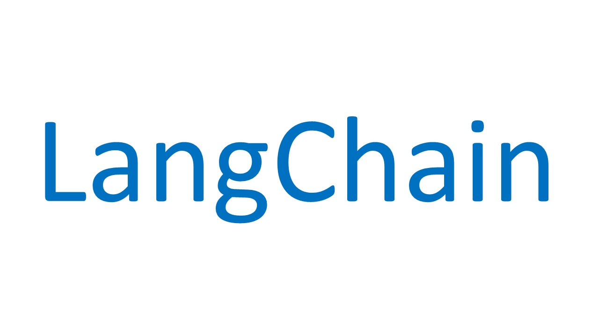

# Discovering Langchain with use cases:
### Chat with your Documents
### Chatbot Translator
### Chat with Wikipedia
### Synthetic Data Generator

LangChain is a framework designed for developing applications around Large Language Models.
The idea behind the framework is to "chain" together different components in order to build more advanced use cases exploiting 
Large Language Models.

Read the article -> https://shorturl.at/rxyNS
