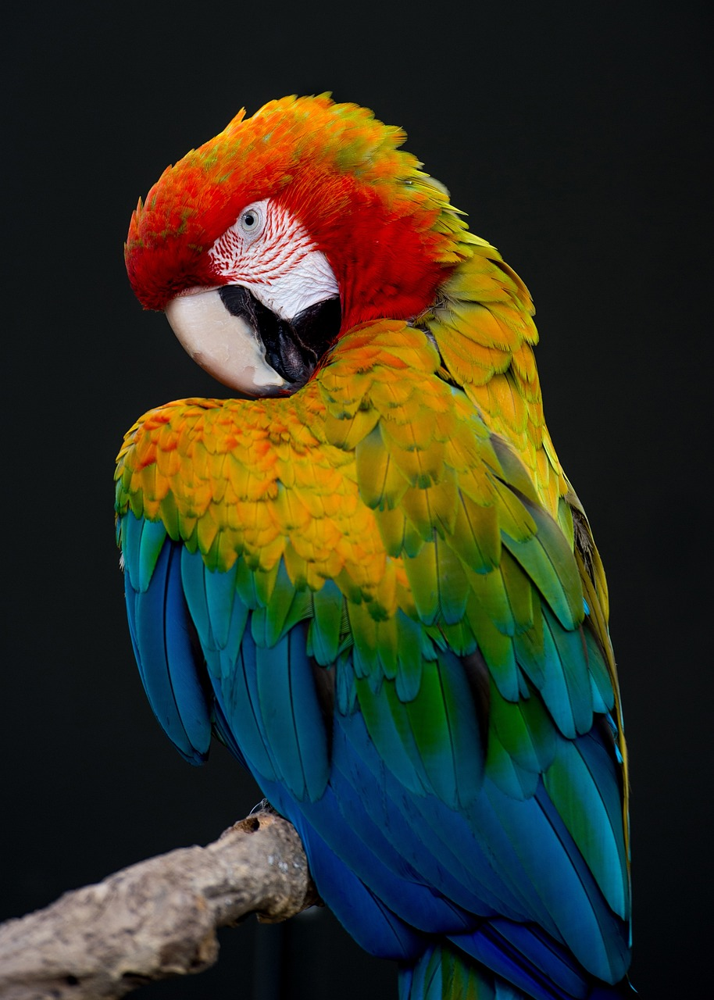

# LangChain & OpenAI in Action
### Text Data Analysis
### Image Data Analysis
### Video Data Analysis
### Document Data Analysis

LangChain, OpenAI and Google Colaboratory all together are a powerful mix of tools for performing data analysis on several types of data, 
which can be helpful in the data scientist activity, moreover ingesting them in the loop can improve productivity.

Read the [article](https://medium.com/@c.giancaterino/langchain-openai-in-action-with-different-data-sources-e089ca43c90a) 

